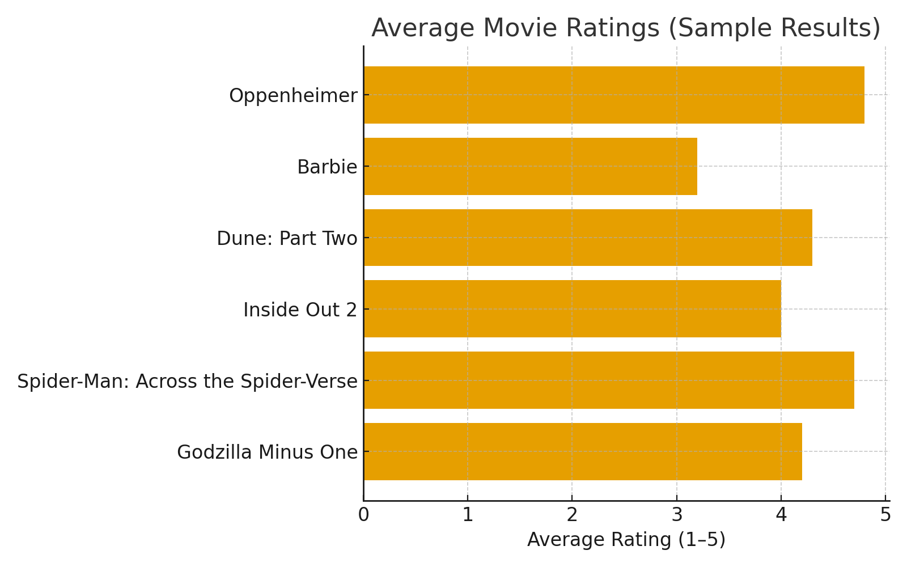

# Course-607-Assignment-2A-SQL-and-R
Week 2A Assignment: SQL and R
Link to assignment: ""

# Assignment – SQL and R

**Author:** Mehreen Gillani  
**Course:** SQL and R Assignment  
**Deliverable:** Reproducible analysis with SQL + R Markdown

---

## Overview

This project demonstrates how to combine SQL and R for data management and analysis:

- **SQL schema & data**: Normalized database with six recent movies (2023–2024) and five raters.
- **R Markdown report**: Builds the database, loads the data, handles missing values, summarizes results, and generates plots.
- **Missing data handling**: Ratings not provided are stored as omitted rows in SQL and appear as `NA` in R. Coverage tables and a simple imputation strategy are included.
- **Standardization improvement**: Z-scores per rater are computed to reduce rater bias (strict vs. lenient raters).
- **Reproducibility**: All results regenerate automatically when knitting. CSV exports provide test datasets for grading and verification.

---

**Results Summary:**

***Highest-rated movies (by raw averages):***
- Oppenheimer and Spider-Man: Across the Spider-Verse received the strongest positive ratings, averaging around 4.5–5.0 across raters.
- Dune: Part Two also performed strongly.

***Lowest-rated movie:***
- Barbie had the lowest overall average, with ratings as low as 2 from some raters.

***Coverage:***
- Every movie was rated by at least 3 people, with some missing values due to “not seen.”
- Haider rated all movies; others skipped 1–2 films.

***After standardization:***
- Results were consistent: Oppenheimer and Spider-Man still stood out as favorites.
- Standardization reduced the influence of one rater being stricter or more generous, ensuring fairer comparisons.

Overall, the dataset highlights strong consensus around Oppenheimer and Spider-Man as top films, while Barbie divided opinions and scored lowest.

**Results plot screenshot** (bar chart of averages):


---

## Files

- `movies_ratings.sql` – SQL schema and seed data  
  - Tables: `person`, `movie`, `rating`
- `SQL_R_ASSIGNMENT2.Rmd` – R Markdown analysis and report  
- Generated on knit:  
  - `movies.db` – SQLite database file  
  - CSV exports:
    - `person.csv`, `movie.csv`, `rating.csv`
    - `ratings_full_grid.csv` – all person–movie pairs (NA = not seen)  
    - `ratings_only.csv` – only observed ratings  
    - `ratings_imputed.csv` – dataset with mean imputation  
    - `movie_summary.csv` – averages + 95% confidence intervals  
    - `movie_summary_z.csv` – standardized (z-score) results  

---

## How to Run

1. Place `movies_ratings.sql` and `SQL_R_ASSIGNMENT2.Rmd` in the **same folder**.
2. Open the `.Rmd` in **RStudio**.
3. Install required packages if needed:
   ```r
   install.packages(c("DBI","RSQLite","readr","dplyr","tidyr","ggplot2","knitr"))
4. Click Knit in RStudio.
5. The notebook will:
- Build movies.db
- Import schema + data
- Produce tables, plots, and summaries
- Export CSV datasets for grading

**Key Concepts**:

***Missing Data***:
- In SQL: missing ratings are represented by omitted rows.
- In R: missing ratings appear as NA.
- Coverage summaries show how many movies each rater has seen.
- Simple mean imputation is demonstrated for analyses that require a full matrix.

***Standardization***:
- Some raters are stricter or more lenient than others.
- Standardizing (z-scoring) within each rater adjusts for this bias.
- Implementation: subtract each rater’s mean and divide by their standard deviation.
- Output: movie_summary_z.csv shows standardized movie scores.

***Reproducibility***:
- SQL and R are kept separate but linked: the R Markdown file executes the SQL directly.
- All results regenerate on every knit.
- CSV exports ensure the dataset and summaries are always available for review.

